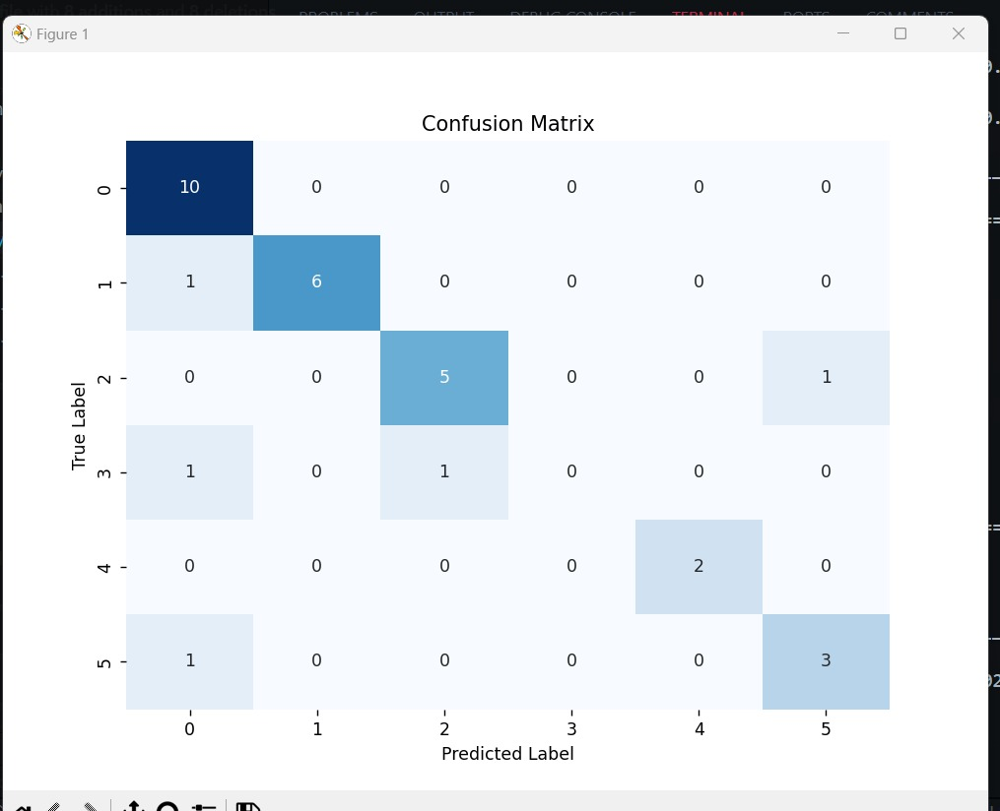
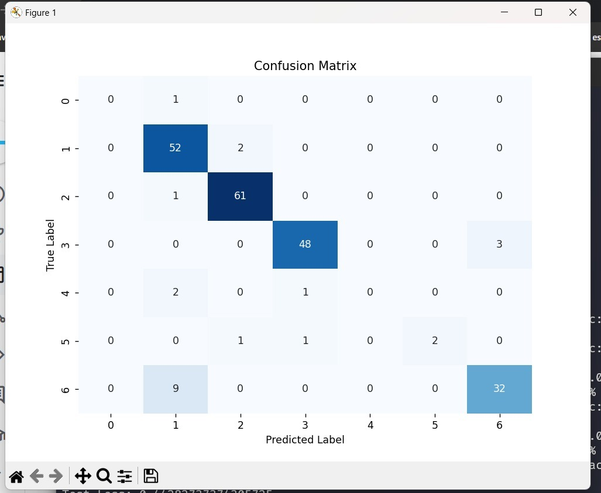
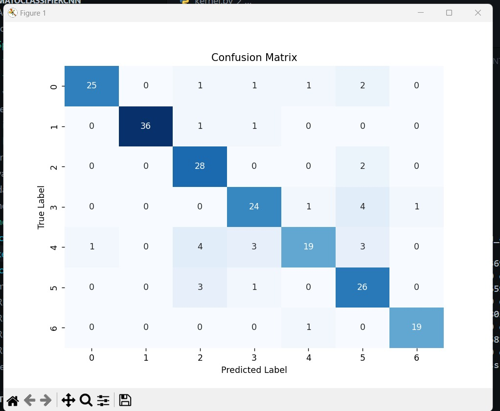
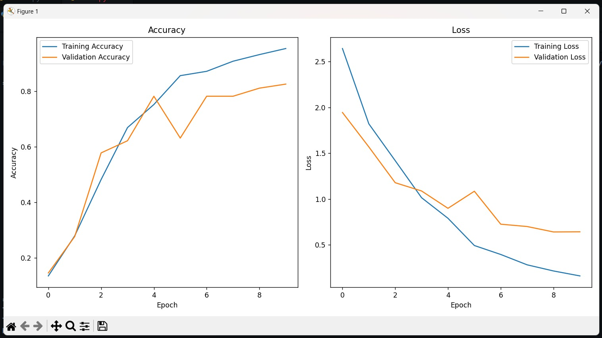
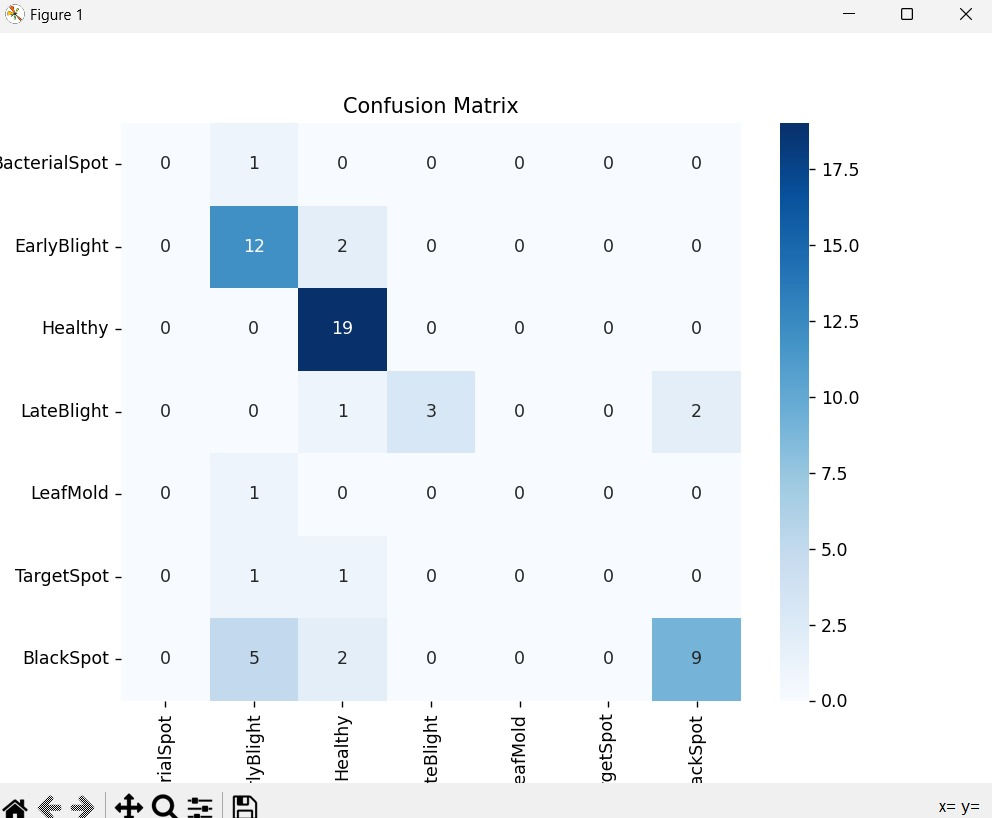
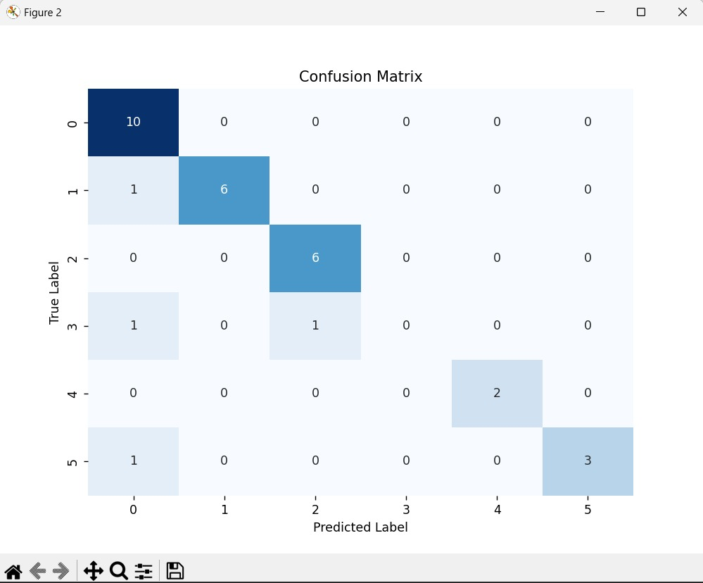
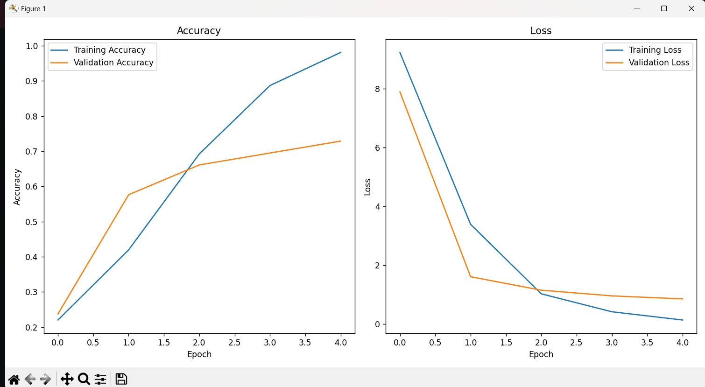
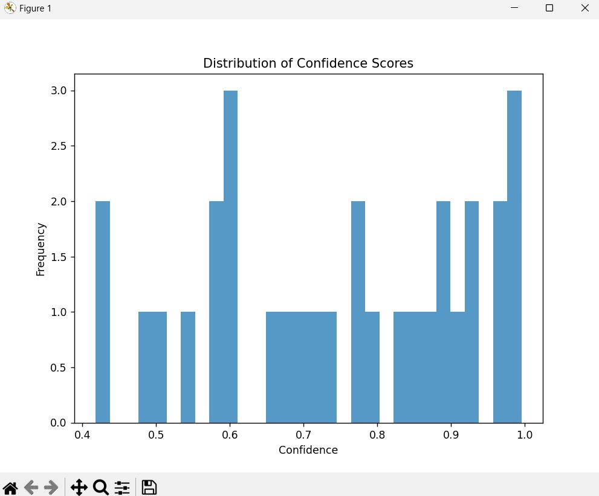
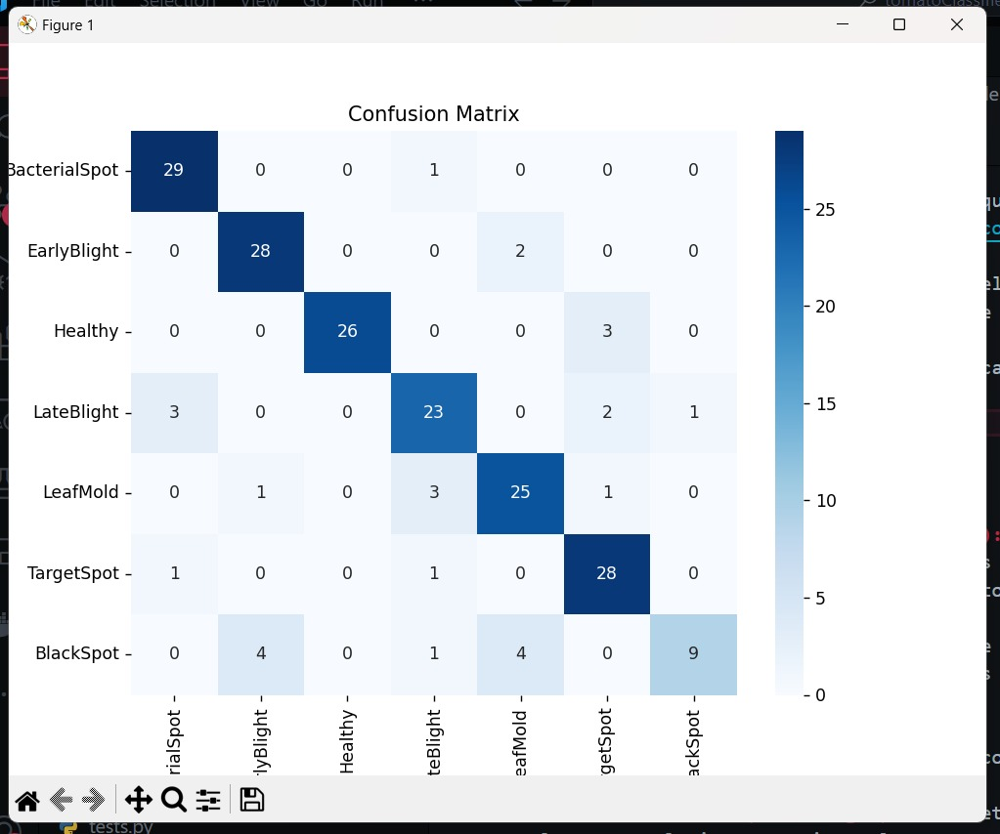
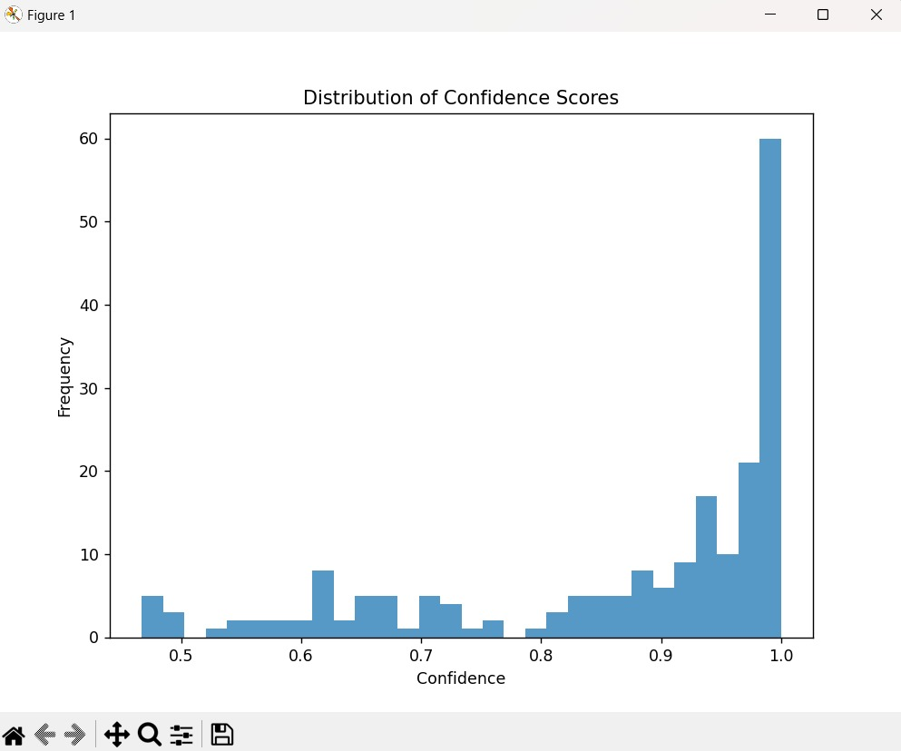

# Tomato Classifier CNN

Este proyecto tiene como objetivo detectar con la mayor precisión posible las lesiones en las hojas de plantas de tomate y distinguir entre 7 categorías diferentes.


## Running

El proyecto puede ejecutarse con el comando:

```bash
python .\kernel.py
```

Esto comenzará la ejecución. Durante la ejecución, se separa el proceso en diferentes pasos. Para cada paso, se te preguntará si quieres ejecutarlo o seguir al siguiente. Esto puede ser útil si quieres evitar entrenar el modelo.

## Estructura de archivos

- `./SplitData` contiene el dataset final usado.
- `kernel.py` tiene el hilo de ejecución principal.
- `loadData.py` tiene funciones de preprocesado y carga de los datos.
- `model.py` contiene todo lo relacionado al modelo, como creación, entrenamiento y graficado.
- `tests.py` contiene todas las pruebas y gráficas finales para los datos de prueba.


## Dataset

El conjunto de datos proviene de:

- [Tomato Leaf Diseases Detection - Kaggle](https://www.kaggle.com/datasets/farukalam/tomato-leaf-diseases-detection-computer-vision)
- [Tomato Leaf Diseases Detect - Roboflow](https://universe.roboflow.com/sylhet-agricultural-university/tomato-leaf-diseases-detect)

Proporcionado por un usuario de Roboflow.

El conjunto de datos original incluía 737 imágenes de hojas de tomate con lesiones. Las lesiones están anotadas en formato YOLO v5 PyTorch. Las imágenes han sido preprocesadas de la siguiente manera:

- Orientación automática de los datos de píxeles (con eliminación de la orientación EXIF).
- Redimensionamiento a 640x640 (estiramiento).

Durante la fase de construcción del modelo al ver la matriz de confusión en varias ocasiones me di cuenta de que algo estaba raro ya que la mayoría de los predict se acumulaban en ciertas clases.

En este punto me di cuenta de que el balanceo de los datos era malo y decidí arreglarlo de la siguiente manera:

Número de etiquetas de clase 0 Bacterial Spot: 13
Agregar 187-
Número de etiquetas de clase 1 Early Blight: 250
Número de etiquetas de clase 2 Healthy: 188
Agregar 12-
Número de etiquetas de clase 3 Late Blight: 108
Agregar 92-
Número de etiquetas de clase 4 Leaf Mold: 18
Agregar 182-
Número de etiquetas de clase 5 Target Spot: 13
Agregar 187-
Número de etiquetas de clase 6 Black Spot: 127
Agregar 73

Todos los datos agregados provienen de aquí (se utilizó el helper 1 y 2 para incorporar los datos): [PlantVillage Tomato Leaf Dataset](https://www.kaggle.com/datasets/charuchaudhry/plantvillage-tomato-leaf-dataset)

Por último, en las últimas fases del modelo me di cuenta de que aún había algunas imágenes que metían ruido ya que estaban en blanco y negro, por lo que decidí eliminarlas.

El dataset usado puede observarse en la carpeta SplitData.

## Paper de Referencia

[Paper CNN](https://www.sciencedirect.com/science/article/pii/S2590005623000383#bib21)

Tambien puede encontrar el pdf en este repo como: 
`ReferencePaper.pdf`

## Categorias

1. **Manchas Bacterianas (Bacterial Spot):** Las hojas de tomate afectadas muestran pequeñas manchas de agua que luego se convierten en manchas necróticas con un halo amarillo. En casos severos, puede llevar a la defoliación de la planta y disminución del rendimiento.

2. **Mildiú Temprano (Early Blight):** Se caracteriza por lesiones irregulares cerca del suelo, que se tornan amarillas y luego se oscurecen en anillos concéntricos negros. Pueden presentar una región clorótica alrededor de la lesión.

3. **Sano (Healthy):** Hojas vigorosas, con color uniforme, crecimiento abierto y una apariencia erguida.

4. **Mildiú Tardío (Late Blight):** Se detecta en las hojas recién desarrolladas en la parte superior de la planta. Las lesiones son irregulares y encharcadas al principio, luego las hojas afectadas se vuelven marrones, marchitas y mueren.

5. **Moho en las Hojas (Leaf Mold):** Pequeñas manchas redondas, verde-amarillentas y borrosas en la parte superior de las hojas, causadas por el hongo Passalora fulva.

6. **Mancha Objetivo (Target Spot):** Se inicia como pequeñas manchas llenas de agua, que se convierten en lesiones necróticas con centros marrones claros y márgenes oscuros. Puede afectar la producción al disminuir el área fotosintética y la calidad del fruto.

7. **Manchas Negras (Black Spot):** Pueden ser causadas por varias enfermedades fúngicas, desarrollándose en condiciones de alta humedad. Provocan lesiones necróticas en las hojas que pueden llevar a la defoliación y reducción del rendimiento del cultivo.


## Model

| Parameter               | Value                    |
|-------------------------|--------------------------|
| Optimization algorithm  | Adam optimizer           |
| Learning rate (α)       | 0.001                    |
| Batch size              | 32                       |
| Number of epochs        | 22                       |
| Dropout rate            | 0.10 (after 3rd Conv2D), 0.5 (after 4th Conv2D and 1st Dense) |
| Loss function           | Sparse categorical crossentropy |
| Activation function (Hidden layers) | ReLU          |
| Activation function (Output layer)  | Softmax       |


- Uso Sparce categorical cross entropy como loss basado en 
lo aprendido en la clase para problemas de clasificacion  ya que la manera en la que castiga pormueve un mejor aprendizaje

- Uso softmax en la utima capa ya que sigmoid ni binary no serian lo apropiado por el numero de clases que tengo

- Uso un dropout mayor en las pirmeras capas ya que no querio que memorizen y mas bajoen las siguientes para que nos se pierda repetinamente el aprendizaje en el refinamiento

### Preprocesado

Los datos requirieron de varias técnicas de preprocesado para mejorar el aprendizaje del modelo.

Durante las primeras iteraciones de la creación del modelo, únicamente me encargaba de dividir el dataset en Train y test y de normalizar los datos.

Pronto me di cuenta de la importancia de entender las características de las diferentes clases, ya que yo mismo a simple vista no sabía la diferencia. Investigué un poco sobre las enfermedades y las características vitales para distinguirlas y fue así que me di cuenta de que el color y la forma de las manchas eran de las características más relevantes a destacar.

Sentándome a ver mi dataset, me di cuenta de que los reflejos y las sombras en las imágenes podían estar afectando mucho el aprendizaje de la red ya que ambos cambiaban la pigmentación de ciertas regiones de la imagen.

Con ello implementé funciones dentro de mi script loaddata para eliminar este ruido usando filtros usando OpenCV.

Otro preprocesado que está presente en el código es el balanceo de las clases después de la agregación de nuevas imágenes. Fue necesario hacer un shuffle personalizado que se encargara de que los datasets de train, test y val tuvieran porcentajes similares de cada clase.

### Evolución del Modelo

El modelo fue evolucionando a través del tiempo mientras fui comprendiendo mejor las características relevantes en mis datos y el efecto que cada capa provocaba.

Empecé por un modelo super simple:

**v1**
```python
model = Sequential([
    Flatten(input_shape=(640,640,3)),
    Dense(128, activation='relu'),
    Dense(7, activation='softmax')
])
```

**v2**
En este modelo decidí eliminar un poco de complejidad redimensionando mis imágenes, reduciendo así el tiempo de entrenamiento:

```python
model = Sequential([
    Flatten(input_shape=(224,224,3)),
    Dense(128, activation='relu'),
    Dense(7, activation='softmax')
])
```

**v3**

Mi primer modelo convolucional donde reduje aún más la dimensión de las imágenes. En este punto me di cuenta de que las capas convolucionales serían de gran utilidad ya que necesitaba destacar ciertas características específicas de las imágenes, en especial el color y la forma de las manchas.

```python
model = Sequential([
    Conv2D(32, (3, 3), activation='relu', input_shape=(128, 128, 3)),
    MaxPooling2D((2, 2)),
    Flatten(input_shape=(128,128,3)),
    Dense(128, activation='relu'),
    Dense(7, activation='softmax')
])
```

Finalmente, después de las primeras asesorías, se me recomendó buscar algún paper que implementara algo similar para poder mejorar mi modelo con ello.

Basándome en este paper, me di cuenta de varias características importantes, como que sugería una arquitectura con mayor cantidad de capas convolucionales ya que se necesita abstraer las características relevantes del modelo.

También me di cuenta de que se utilizaba una arquitectura donde se empezaba con capas convolucionales más grandes evolucionando hacia capas más pequeñas. Esto es útil ya que el modelo puede atacar inicialmente características más complejas y generales y refinar hacia características mucho más específicas.

Además de esto, al entrenar me di cuenta de que tenía overfitting ya que llegaba a acc 1 muy rápido, y decidí introducir droputs ya que la red sí estaba aprendiendo pero estaba memorizando las imágenes y al hacer la matriz de confusión se podía observar que los valores predichos no eran buenos. Con la regularización se lograron buenos resultados.

```python
model = Sequential([
        Conv2D(100, (3, 3), activation='relu', input_shape=(128, 128, 3)),
        MaxPooling2D((2, 2)),
        Dropout(0.25),
        Conv2D(64, (3, 3), activation='relu'),
        MaxPooling2D((2, 2)),
        Dropout(0.25),
        Flatten(input_shape=(128,128,3)),
        Dense(128, activation='relu'),
        Dense(7, activation='softmax')
    ])
```

Finalmente, probé muchas diferentes combinaciones de hiper parámetros y añadí capas y llegué a mi mejor modelo.

Este modelo fue el mejor dio en general en todas las pruebas, otros intentos mejoraron otros aspectos pero este fue el mejor en general. Ajusté varias veces los droputs, número de capas y el tamaño de las capas convolucionales, otros modelos con capas más pequeñas al final parecían ser demasiado abstractos y no ayudaron al modelo a aprender más.

```python
model = Sequential([
        Conv2D(128, (3, 3), activation='relu', input_shape=(128, 128, 3)),
        MaxPooling2D((2, 2)),
        Conv2D(64, (3, 3), activation='relu'),
        MaxPooling2D((2, 2)),
        Conv2D(32, (3, 3), activation='relu'),
        MaxPooling2D((2, 2)),
        Dropout(0.10),
        Conv2D(32, (3, 3), activation='relu'),
        MaxPooling2D((2, 2)),
        Dropout(0.5),
        Flatten(input_shape=(128,128,3)),
        Dense(300, activation='relu'),
        Dropout(0.5),
        Dense(7, activation='softmax')
    ])
```

## Evolucion de los resultados

Antes del balanceo pocos datos en test (5%)


Despues del balanceo  test (20%) sin embargo hacian falta datos


Despues de agregar mas datos a otras clases


Mayor Acc lograda



## Resultados primer y utimo modelo

# Modelo 3 

First Model Train


First Model Test


First Train Metrics


First Model Confidence


# Modelo Final


Last Model Train


Last Model Test


Last Train Metrics


Last Model Confidence



